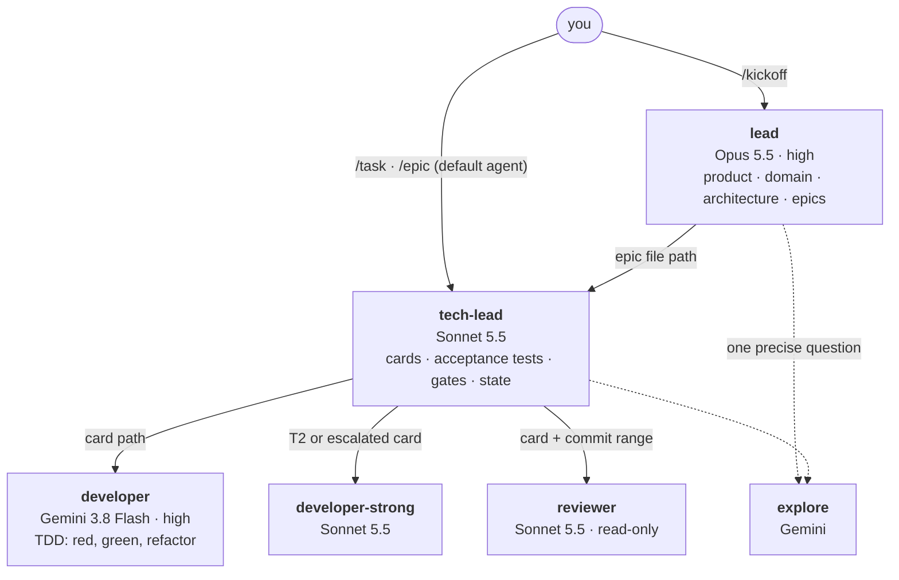
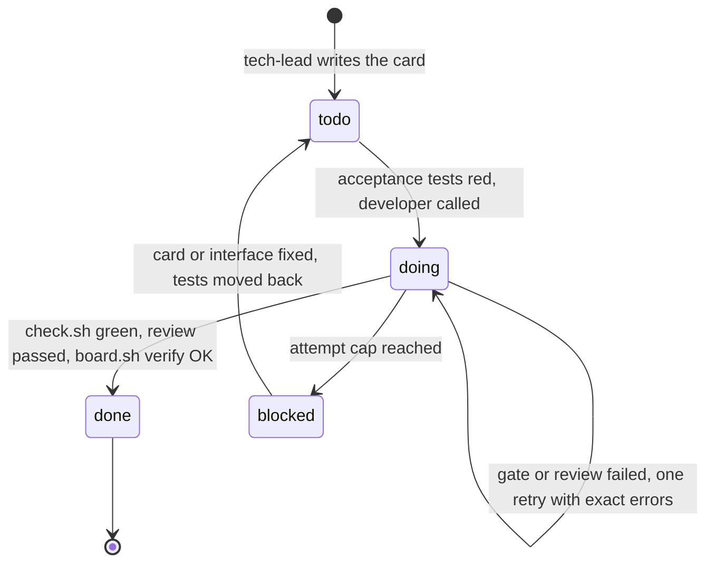

# opencode-team

[](https://github.com/hdkhosravian/opencode-team/actions/workflows/ci.yml)
[](LICENSE)

**A small AI engineering team for [OpenCode](https://opencode.ai), built around one rule: the more expensive the model, the less it talks.**

An Opus-class lead decides what to build. A Sonnet-class tech lead turns decisions into task cards and frozen acceptance tests. A cheap Gemini developer does the typing, under strict TDD. Scripts, not models, decide whether anything is actually done.

[فارسی](README.fa.md) · [Docs](docs/) · [Changelog](CHANGELOG.md)

---

## Why this exists

Most multi-agent setups burn tokens in three places: expensive models reading code they didn't need to read, agents re-explaining state to each other in chat, and models grading their own homework. This kit attacks all three.

- **Expensive models plan, cheap models type.** Opus never reads a diff. It asks a cheap `explore` agent one precise question and reads a 30-line report.
- **State lives in files, not in chat.** The header of each task card is the single source of truth. `scripts/board.sh` prints the board for zero tokens.
- **Nobody certifies their own work.** The developer can't edit the acceptance tests, the gate script or the card header. `check.sh` and `board.sh verify` are deterministic, and a Claude reviewer checks Gemini's code, so their blind spots don't overlap.
- **Complexity is opt-in.** A typo fix is one paragraph and one gate run. A hard payments card gets the stronger developer and a mandatory review. A 40-item migration gets a ledger and a completion gate. The tech lead picks the cheapest lane that is safe.

## The team



| Agent | Model | Does | Never does |
|---|---|---|---|
| `lead` | Opus 5.5, high | Product brief, domain model (DDD), ADRs, epics cut into frozen slices | Read code wholesale, track card status |
| `tech-lead` | Sonnet 5.5 | Picks the lane, writes cards and acceptance tests, runs the gate, owns all task state | Write production code |
| `developer` | Gemini 3.8 Flash, high | Implements one card with red-green-refactor | Touch acceptance tests, docs, gate config, card headers |
| `developer-strong` | Sonnet 5.5 | Same job for T2 (risky) cards or cards Gemini couldn't do | Same locks as `developer` |
| `reviewer` | Sonnet 5.5 | Read-only review of one change or one finished epic, evidence only | Edit anything |
| `explore`, `general`, `title`, `compaction` | Gemini | Cheap background work | |

Engineering principles (SOLID, DDD, design patterns, Clean Code, TDD, hexagonal architecture) live in 14 small skills that load only when an agent needs them. Each agent sees only its own skills, so the skill list in the prompt stays short. See [docs/architecture.md](docs/architecture.md).

## Quick start

Requirements: macOS, `git`, `curl`, an Anthropic API key and a Google (Gemini) API key. No Homebrew or Xcode needed.

```bash
git clone https://github.com/hdkhosravian/opencode-team ~/Tools/opencode-team
bash ~/Tools/opencode-team/setup.command
```

The script installs OpenCode with the official prebuilt installer (2.x by default, 1.x with `OPENCODE_MAJOR=1`), backs up any existing `~/.config/opencode`, installs the team globally, checks the model IDs against models.dev and validates the result. It writes a full log to `setup.log`.

Then, in a **new** terminal tab:

```bash
cd your-project        # must be a git repository
opencode
```

1. `/connect` and add **Anthropic** and **Google**.
2. `/team-init` once per project. It creates `PROGRESS.md`, `docs/`, the gate script and the task board, and fills in `AGENTS.md`.
3. `/kickoff <idea>` for a new product, or `/task <what you want>` for a feature or fix.

Not on macOS? The kit itself is just files. Copy `global/` to `~/.config/opencode/` (and, for OpenCode 2.x, copy `global-v2/` over it), then `chmod +x` the scripts under `team/`. Details in [docs/customizing.md](docs/customizing.md).

## What a task looks like



A card is a short markdown file. The header is the task's state:

```
# 003 refund
Epic: EPIC-01
Risk: T2
Depends: 002
Dev: developer-strong
Status: doing
Attempts: 1
Review: -
Note: -
```

And `scripts/board.sh` reads those headers, no model involved:

```
$ scripts/board.sh
BOARD cards 6: done 2, doing 1, todo 2, blocked 1
EPIC-01 orders  slices 1/3  cards 2/6
 003 doing   T2 strong try 1  rev -  refund
 006 blocked T1 dev    try 3  rev BLOCK  export  note: Gemini cannot stream CSV; needs redesign
 004 todo    T1 dev    try 0  rev -  list  after 002
 005 todo    T1 dev    try 0  rev -  notify  after 003
```

`board.sh verify` is what "done" means. A card passes only if a `feat|fix|refactor|perf|chore(NNN)` commit exists, a T1+ card has a `PASS` review, its acceptance test files exist, attempts are within the caps, dependencies are done, and the epic's slice count hasn't been edited. The full lifecycle, lanes, review policy and escalation rules are in [docs/task-lifecycle.md](docs/task-lifecycle.md).

### Lanes: the cheapest one that is safe

| Lane | When | What happens |
|---|---|---|
| Trivial | A few lines, no new behavior, or an obvious small bug fix | One paragraph to `developer`, one gate run. No card, no review |
| Card | One behavior (the default) | Card, red acceptance tests, `developer`, gate, review if T1 |
| Hard card | T2 (auth, money, data loss, migrations, concurrency, security) or Gemini failed | `developer-strong`, always reviewed, tech lead reads the risky diff |
| Slice | An epic slice with several cards | Cards in order, one writer at a time |
| Batch | 6+ similar items, migrations, audits, anything that must survive a pause | [`loop-contract`](docs/loop-contract.md): frozen scope, per-item proof, a gate that decides |

If the tech lead is unsure between two lanes it takes the lower one and lets a failed check or review move the work up.

## Commands

| Command | Agent | Does |
|---|---|---|
| `/team-init` | tech-lead | One-time project setup |
| `/kickoff <idea>` | lead | Brief, domain model, ADRs, epics |
| `/epic <epic path>` | tech-lead | Delivers the **next slice** of an epic; run again to continue |
| `/task <description or card path>` | tech-lead | One feature or fix through the pipeline |
| `/review` | reviewer | Review current changes |
| `/status` | general (Gemini) | Board and `PROGRESS.md` summary, no Claude tokens |

`Tab` switches between `lead` and `tech-lead`. After any pause, tell the tech lead to continue: it reads the board and resumes from the unfinished card.

## Token strategy in one screen

- Default agent is Sonnet, not Opus. Daily work never touches Opus.
- Opus reads reports (30 lines max), never code or diffs.
- Background agents (explore, title, compaction) run on Gemini.
- Hand-offs are file paths, not pasted summaries.
- Skills are scoped per agent; `loop-contract`'s long description is cut from 1,400 to about 300 characters, and its 10k-token body loads only for real batch jobs.
- `check.sh` prints only the last 40 lines of a failing step. `board.sh` costs nothing.
- Hard attempt caps on every card, stored in the card so compaction can't lose them.
- OpenCode 2.x: `tool_output` is capped at 600 lines / 24 KB, and `warming` stays off.

The full list, with the reasoning, is in [docs/token-management.md](docs/token-management.md).

## What gets created in your project

```
AGENTS.md                 project rules (short; /team-init fills it in)
PROGRESS.md               Now / Open decisions / Lessons, nothing else
docs/product|domain|adr/  brief, glossary and context map, decisions
docs/invariants.md        hard rules the reviewer enforces
tests/acceptance/         frozen acceptance tests (developer can't edit)
tests/blocked/NNN/        red tests of blocked cards, parked outside the gate
.opencode/work/epics/     epics, slices frozen by lead
.opencode/work/tasks/     task cards; each header is that task's state
.opencode/loops/          state of batch jobs (loop-contract)
.opencode/check.cmds      the gate commands (tech-lead owns it)
scripts/check.sh          runs the gate; fails if acceptance tests exist but nothing runs them
scripts/board.sh          the board: status, next card, verify
```

## Safety

Developers can't edit acceptance tests, docs, `.opencode/`, `.github/`, the gate scripts or any OpenCode config. Changes to test-runner config (`package.json`, `pytest.ini`, `conftest.py`, ...) and new dependencies ask you first. `git push`, `reset --hard`, `clean`, `rm -rf`, `sudo` and reading `.env` are denied for everyone. Permissions are ordered so the locks come last (last match wins), which means an `ask` rule can't accidentally reopen a locked path. See [docs/safety-and-permissions.md](docs/safety-and-permissions.md).

## What has and hasn't been tested

Tested on the real OpenCode 1.18.33 binary: all agents resolve with the right model and variant, all 14 skills are found, and 80 permission checks match the design. `board.sh verify` is exercised by 21 cases (CI runs them, see `tests/board/run.sh`) on three awk implementations, including macOS's. `setup.command` was run end to end on a Mac with OpenCode 2.0.20.

**Not tested:** the V2 permission semantics against a V2 binary from outside a Mac (equivalence with V1 was checked on samples, and setup falls back to the V1 format if V2 rejects the config), and live runs with real models. Treat the prompts as a first version and tighten them after a few real tasks. Issues and PRs are welcome.

## Documentation

| | |
|---|---|
| [Architecture](docs/architecture.md) | Roles, models, skills, what was left out on purpose |
| [Task lifecycle](docs/task-lifecycle.md) | Cards, lanes, board, verify rules, review, escalation, pausing |
| [Token management](docs/token-management.md) | Where tokens go and how each leak is closed |
| [Safety and permissions](docs/safety-and-permissions.md) | Locks, ordering, V1 vs V2 formats |
| [loop-contract](docs/loop-contract.md) | How the batch-job skill is wired in |
| [Tools evaluated](docs/tools-evaluated.md) | context-mode, headroom, hyperresearch, prime-agent and why not (yet) |
| [Customizing](docs/customizing.md) | Change models, gates, skills; regenerate V2; run tests |
| [Troubleshooting](docs/troubleshooting.md) | Installer, config and gate problems |

## Credits

The batch-job skill is [loop-contract-skill](https://github.com/hdkhosravian/loop-contract-skill) (MIT), adapted for OpenCode. The other 13 skills were written for this kit.

## License

[MIT](LICENSE)
