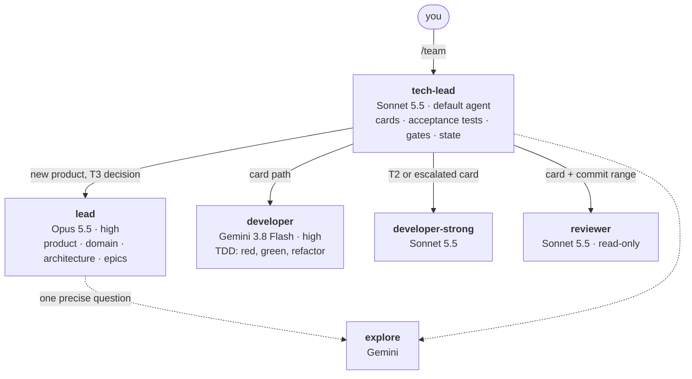
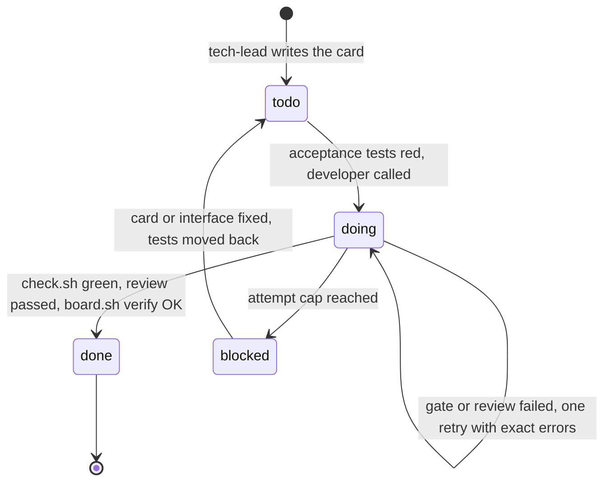

# opencode-team

[](https://github.com/hdkhosravian/opencode-team/actions/workflows/ci.yml)
[](LICENSE)

**A small AI engineering team for [OpenCode](https://opencode.ai), built around one rule: the more expensive the model, the less it talks.**

An Opus-class lead decides what to build. A Sonnet-class tech lead turns decisions into task cards and frozen acceptance tests. A cheap Gemini developer does the typing, under strict TDD. Scripts, not models, decide whether anything is actually done. And you drive all of it with one command: `/team`.

[فارسی](README.fa.md) · [Docs](#documentation) · [Changelog](CHANGELOG.md)

---

## Why this exists

Most multi-agent setups burn tokens in three places: expensive models reading code they didn't need to read, agents re-explaining state to each other in chat, and models grading their own homework. This kit attacks all three.

- **Expensive models plan, cheap models type.** Opus never reads a diff. It asks a cheap `explore` agent one precise question and reads a 30-line report.
- **State lives in files, not in chat.** The header of each task card is the single source of truth. `scripts/board.sh` prints the board for zero tokens.
- **Nobody certifies their own work.** The developer can't edit the acceptance tests, the gate script or the card header. `check.sh` and `board.sh verify` are deterministic, and the reviewer is a different model family from the developer, so their blind spots don't overlap.
- **Complexity is opt-in.** A typo fix is one paragraph and one gate run. A hard payments card gets the stronger developer and a mandatory review. A 40-item migration gets a ledger and a completion gate. The tech lead picks the cheapest lane that is safe.

## The team



| Agent | Model (default) | Does | Never does |
|---|---|---|---|
| `lead` | Opus 5.5, high | Product brief, domain model (DDD), ADRs, epics cut into frozen slices. Called by the tech lead, or talked to directly (`Tab`, `/kickoff`) | Read code wholesale, track card status |
| `tech-lead` | Sonnet 5.5 | Picks the lane, writes cards and acceptance tests, runs the gate, owns all task state. The default agent | Write production code |
| `developer` | Gemini 3.8 Flash, high | Implements one card with red-green-refactor | Touch acceptance tests, docs, gate config, card headers |
| `developer-strong` | Sonnet 5.5 | Same job for T2 (risky) cards or cards Gemini couldn't do | Same locks as `developer` |
| `reviewer` | Sonnet 5.5 | Read-only review of one change or one finished epic, evidence only | Edit anything |
| `reporter` | background model | Read-only `/status`: runs `board.sh`, reads `PROGRESS.md` | Edit anything |
| `explore`, `general`, `title`, `compaction`, `summary` | background model | Cheap background work | |

Every model above is a default you can change at any time with `/model` ([Change the models](#change-the-models)). Engineering principles (SOLID, DDD, design patterns, Clean Code, TDD, hexagonal architecture) live in 14 small skills that load only when an agent needs them; each agent sees only its own, so the skill list in the prompt stays short. See [docs/architecture.md](docs/architecture.md) and [docs/skills.md](docs/skills.md).

## Quick start

Requirements: macOS or Linux, `bash`, `git`, `curl`, and an API key for each provider you use (the default setup uses Anthropic and Google). `python3` (3.8 or newer) is optional and adds the model and permission checks and `/model`. No Homebrew or Xcode needed.

```bash
git clone https://github.com/hdkhosravian/opencode-team ~/Tools/opencode-team
bash ~/Tools/opencode-team/setup.sh      # macOS: you can also double-click setup.command
```

The script installs OpenCode with the official prebuilt installer (2.x by default, 1.x with `OPENCODE_MAJOR=1`), backs up any existing `~/.config/opencode`, installs the team globally, applies [`models.conf`](models.conf), installs the third-party skill from its git repository, checks the model IDs against models.dev and validates the result against the real OpenCode. It writes a full log to `setup.log`. Run it again to update. Details: [docs/installation.md](docs/installation.md).

Then, in a **new** terminal tab:

```bash
cd your-project        # must be a git repository
opencode
```

1. `/connect` and add **Anthropic** and **Google** (or the providers you chose).
2. `/team`. In a new project it sets everything up (`PROGRESS.md`, `docs/`, the gate script, the board, `AGENTS.md`). Then tell it what you want: `/team build a todo app`, or `/team fix the login redirect`.

## One command: /team

Type `/team` and the team works out the rest. A script (no model tokens) reads the project and computes the state; the tech lead picks the route from that state and what you typed, then does the work and calls `lead`, `developer`, `developer-strong`, `reviewer` and `explore` as needed.

| You type | What happens |
|---|---|
| `/team` | Resumes: the card in progress, the next ready card, or the next slice of the open epic. A project that is not set up yet is set up first. |
| `/team build a todo app` | Nothing is planned yet: the tech lead calls `lead` (Opus) for the brief, domain notes, ADRs and epics, then delivers the first slice. |
| `/team fix the login redirect` | The tech lead picks the lane (trivial, card, hard card, slice, batch) and does it. |
| `/team EPIC-01`, `/team 3`, or a file path | Delivers the next slice of that epic, or runs that card. |
| `/team all` | Keeps going slice after slice. Stops at 4 slices, a blocked card, an open decision, or when the epic is done. |
| `/team review [range]` | Reviews the current changes, or a commit range. |
| `/team status` | The board and `PROGRESS.md`. |
| `/team model developer openai/gpt-5.4-nano` | Same as `/model` ([below](#change-the-models)). |
| `/team init` | Sets up (or checks) the project files. |

One call does one unit of work (a card or a slice), so every call starts with a fresh context and a paused session loses nothing: run `/team` again to continue. What you type is never put into a shell line, so apostrophes and backticks are safe. The older commands (`/team-init`, `/kickoff`, `/epic`, `/task`, `/review`, `/status`) still work as shortcuts that force one route. Everything about `/team`, the routes and the shortcuts: [docs/commands.md](docs/commands.md).

## What a task looks like



A card is a short markdown file. The header is the task's state:

```
# 003 refund
Epic: EPIC-01
Risk: T2
Depends: 002
Dev: developer-strong
Status: doing
Attempts: 1
Review: -
Note: -
```

And `scripts/board.sh` reads those headers, no model involved:

```
$ scripts/board.sh
BOARD cards 6: done 2, doing 1, todo 2, blocked 1
EPIC-01 orders  slices 1/3  cards 2/6
 003 doing   T2 strong try 1  rev -  refund
 006 blocked T1 dev    try 3  rev BLOCK  export  note: Gemini cannot stream CSV; needs redesign
 004 todo    T1 dev    try 0  rev -  list  after 002
 005 todo    T1 dev    try 0  rev -  notify  after 003
```

`board.sh verify` is what "done" means. A card passes only if a `feat|fix|refactor|perf|chore(NNN)` commit exists, a T1+ card has a `PASS` review, its acceptance test files exist, attempts are within the caps, dependencies are done, and the epic's slice count hasn't been edited. The full lifecycle, lanes, review policy and escalation rules are in [docs/task-lifecycle.md](docs/task-lifecycle.md).

### Lanes: the cheapest one that is safe

| Lane | When | What happens |
|---|---|---|
| Trivial | A few lines, no new behavior, or an obvious small bug fix | One paragraph to `developer`, one gate run. No card, no review |
| Card | One behavior (the default) | Card, red acceptance tests, `developer`, gate, review if T1 |
| Hard card | T2 (auth, money, data loss, migrations, concurrency, security) or Gemini failed | `developer-strong`, always reviewed, tech lead reads the risky diff |
| Slice | An epic slice with several cards | Cards in order, one writer at a time |
| Batch | 6+ similar items, migrations, audits, anything that must survive a pause | [`loop-contract`](docs/loop-contract.md): frozen scope, per-item proof, a gate that decides |

If the tech lead is unsure between two lanes it takes the lower one and lets a failed check or review move the work up.

## Change the models

Switch from inside OpenCode, like `/model` in other tools:

```
/model                                   show the six roles and their models
/model developer openai/gpt-5.4-nano     change one role (provider/model, optional #reasoning-level)
/model claude-only                       apply a preset (also: budget)
/model reset                             back to the defaults (or: /model reset developer)
```

The change is written to `~/.config/opencode/team/models.local.conf`, so it survives an update. On OpenCode 2.x it is active at once (the command runs `opencode reload` for you); on 1.x restart `opencode`. `/model` itself runs on the cheap background model. For one session only, use OpenCode's own `/models`. From a terminal, `python3 ~/.config/opencode/team/models.py` opens an interactive picker (`show`, `set`, `preset`, `reset`, `check` also work).

The defaults are one line each in [`models.conf`](models.conf), in six roles (`LEAD`, `TECH_LEAD`, `REVIEWER`, `DEVELOPER`, `DEVELOPER_STRONG`, `BACKGROUND`):

```
DEVELOPER=google/gemini-3.8-flash#high      # provider/model#reasoning-level
```

Edit that file and run `bash setup.sh` again to change the defaults. Each provider needs `/connect`. `models.py` warns when the reviewer and a developer share a provider (a reviewer from the same family shares the author's blind spots). Everything about models: [docs/models.md](docs/models.md).

## Skills

13 skills are written for this kit and live in `global/skills/`. The 14th, `loop-contract`, belongs to someone else's repository, so it is **not** copied here: `global/team/skills.lock` pins its git repository and commit, and `setup.sh` clones it, applies a small OpenCode patch and installs it. Any skill from any git repository can be added with one line. See [docs/skills.md](docs/skills.md).

## Token strategy in one screen

- Default agent is Sonnet, not Opus. Daily work never touches Opus; only the tech lead can call `lead`.
- Opus reads reports (30 lines max), never code or diffs.
- Background agents (explore, title, compaction, reporter, `/model`) run on the `BACKGROUND` model, Gemini by default.
- Hand-offs are file paths, not pasted summaries.
- `/team` finds out what to do next with a script, not a model: zero tokens.
- Skills are scoped per agent; `loop-contract`'s long description is cut from 1,400 to about 300 characters, and its 10k-token body loads only for real batch jobs.
- `check.sh` prints only the last 40 lines of a failing step. `board.sh` costs nothing.
- Hard attempt caps on every card, stored in the card so compaction can't lose them.
- OpenCode 2.x: `tool_output` is capped at 600 lines / 24 KB, and `warming` stays off.

The full list, with the reasoning, is in [docs/token-management.md](docs/token-management.md).

## What gets created in your project

```
AGENTS.md                 project rules (short; /team fills it in)
PROGRESS.md               Now / Open decisions / Lessons, nothing else
docs/product|domain|adr/  brief, glossary and context map, decisions
docs/invariants.md        hard rules the reviewer enforces
tests/acceptance/         frozen acceptance tests (developer can't edit)
tests/blocked/NNN/        red tests of blocked cards, parked outside the gate
.opencode/work/epics/     epics, slices frozen by lead
.opencode/work/tasks/     task cards; each header is that task's state
.opencode/loops/          state of batch jobs (loop-contract)
.opencode/check.cmds      the gate commands (tech-lead owns it)
scripts/check.sh          runs the gate; fails if acceptance tests exist but nothing runs them
scripts/board.sh          the board: status, next card, verify
```

The team itself is installed once, in `~/.config/opencode` (agents, commands, skills, `team/` scripts); see [docs/installation.md](docs/installation.md#what-is-installed-where).

## Safety

Developers can't edit acceptance tests, docs, `.opencode/`, `.github/`, the gate scripts or any OpenCode config. Changes to test-runner config (`package.json`, `pytest.ini`, `conftest.py`, ...) and new dependencies ask you first. `git push`, `reset --hard`, `clean`, `rm -rf`, `sudo` and reading `.env` are denied for everyone. Only the tech lead can call `lead`. Permissions are ordered so the locks come last (last match wins), which means an `ask` rule can't accidentally reopen a locked path. See [docs/safety-and-permissions.md](docs/safety-and-permissions.md).

## Testing

CI runs on Linux and macOS: the 22 `board.sh verify` cases (GNU and BSD `sed`, Linux and macOS awk), the 27 `route.sh` cases, `models.py` (set, preset, reset, `/model`, apply for V1 and V2), `fetch-skills.sh` against a git repository, frontmatter and cross references (skills, sub-agents, roles), and a check that `global-v2/` is regenerated from `models.conf`. A second job runs `setup.sh` for real on Linux with OpenCode 2.x and 1.x.

`setup.sh` validates every install against the real OpenCode (1.18.34 and 2.0.21): the config resolves, each agent gets the model and variant of your choice, 180 permission cases (edit, shell, read, skill, sub-agent, webfetch for all agents) pass on the rules OpenCode computed (`tests/perm_check.py`), and `check.sh`, `board.sh`, `route.sh` and the `loop-contract` gate run. Details: [docs/testing.md](docs/testing.md). Issues and PRs are welcome.

## Documentation

| | |
|---|---|
| [Commands](docs/commands.md) | `/team` in detail: routes, state, auto mode; the shortcuts; `/model`, `/status` |
| [Models](docs/models.md) | The six roles, `/model`, presets, `models.py`, `models.conf`, where models are written |
| [Installation](docs/installation.md) | Requirements, `setup.sh`, what is installed where, update, roll back, Linux, by hand |
| [Architecture](docs/architecture.md) | Roles, layers, how the pieces fit, what was left out on purpose |
| [Task lifecycle](docs/task-lifecycle.md) | The `/team` entry point, cards, lanes, board, verify rules, review, escalation, pausing |
| [Skills](docs/skills.md) | Own skills, third-party skills from git (`skills.lock`), patches |
| [loop-contract](docs/loop-contract.md) | The batch-job skill: what it adds and how it is wired in |
| [Token management](docs/token-management.md) | Where tokens go and how each leak is closed |
| [Safety and permissions](docs/safety-and-permissions.md) | Locks, ordering, who can call whom, shell lines, V1 vs V2 formats |
| [Testing](docs/testing.md) | Every test suite, the real-OpenCode checks, CI |
| [Customizing](docs/customizing.md) | The gate, project rules, agents, layout, regenerating V2, contributing |
| [Troubleshooting](docs/troubleshooting.md) | Installer, config, `/team`, models and project problems |
| [Tools evaluated](docs/tools-evaluated.md) | context-mode, headroom, hyperresearch, prime-agent and why not (yet) |

## Credits

The batch-job skill is [loop-contract-skill](https://github.com/hdkhosravian/loop-contract-skill) (MIT). It is not stored in this repository: `setup.sh` installs it from its git repository at a pinned commit and applies a small OpenCode patch (`global/team/patches/`). The other 13 skills were written for this kit.

## License

[MIT](LICENSE)
