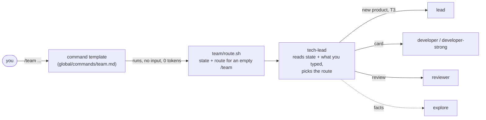

# Commands

One command starts everything: `/team`. The older commands are shortcuts that force one route. `/model` changes models, `/status` shows the board.

## /team



1. **A script reads the project.** `team/route.sh` looks at the files (no model, no tokens) and prints a *state block* and the route an empty `/team` would take.
2. **The tech lead picks the route.** It is the default agent (Sonnet). It sees the state block and what you typed, and maps them to a route with a short table in the command.
3. **It does one unit of work and stops.** A unit is a card or a slice. It reports in 30 lines or less and ends with what the next `/team` will do. Every call starts with a fresh context, and everything that matters is in files (cards, epics, `PROGRESS.md`, git), so closing the terminal loses nothing.

### What you can type

| You type | Route | What happens |
|---|---|---|
| `/team` | from the state | Resume: the card in progress (`RESUME`), the next ready card (`NEXT-CARD`), the next slice of the open epic (`EPIC`). In a project that is not set up, it sets it up first (`INIT`). |
| `/team build a todo app` | `KICKOFF` | Nothing is planned and there are no product docs: the tech lead calls `lead` (Opus) once to write the brief, domain notes, ADRs and epics, then delivers the first slice. |
| `/team fix the login redirect` | `WORK` | The tech lead picks the lane (trivial, card, hard card, slice, batch; see [task-lifecycle.md](task-lifecycle.md)) and does it. A decision with irreversible consequences (T3) goes to `lead`. |
| `/team EPIC-01` or an epic path | `EPIC` | Delivers the next undelivered slice of that epic. |
| `/team 3` or a card path | `CARD` | Runs that card. |
| `/team all` (or `auto`, `continue`) | from the state, auto mode | Takes slice after slice. Stops at 4 slices, at a blocked card, at an open decision, or when the epic is done. |
| `/team go` | from the state | Same as `/team`. |
| `/team review [range]` | `REVIEW` | `reviewer` on the range, or on `git diff HEAD`, or on `git show HEAD` if that is empty. |
| `/team status` | - | Prints the board and the *Now* and *Open decisions* of `PROGRESS.md`. |
| `/team model developer openai/gpt-5.4-nano` | - | Runs `models.py cmd`; same as `/model` (see [models.md](models.md)). |
| `/team init` | `INIT` | Sets up the project files, or checks them. Safe to repeat: nothing existing is overwritten. |

If the project is not set up, every input except `status` and `model` does `INIT` first and then continues with the route the input asks for.

### The state block

This is what the script prints (a real run in a project with a small board):

```
== /team state ==
project: /work/shop
git: yes, branch main, 14 commits, 0 uncommitted files, 52 tracked files
initialized: yes (PROGRESS.md and scripts/board.sh)
gate: 4 command(s) in .opencode/check.cmds
product docs: 1 | epics: 1 | cards: 6 | epic with open slices: .opencode/work/epics/EPIC-01-orders.md (2 open)
planned: yes
epic files: .opencode/work/epics/EPIC-01-orders.md
card files: 001-scaffold 002-place-order 003-refund ... (in .opencode/work/tasks/)
board:
  BOARD cards 6: done 2, doing 1, todo 2, blocked 1
  EPIC-01 orders  slices 1/3  cards 2/6
   003 doing   T2 strong try 1  rev -  refund
   ...
next: RESUME 003  .opencode/work/tasks/003-refund.md  (T2, developer-strong, try 1)  - unfinished: ...
input: (none)
auto: no
note: the ROUTE below is what an EMPTY /team does; a typed request is classified by the rules that follow
ROUTE: RESUME  .opencode/work/tasks/003-refund.md
```

`ROUTE` is always the route of an **empty** `/team`. For anything you type, the tech lead uses the table above. `planned: no` means no epics, no cards and no product docs; that is what makes free text a `KICKOFF` instead of `WORK`. A small task in a repository with many tracked files stays `WORK`.

### Routes

| Route | When (empty `/team`) | What the tech lead does |
|---|---|---|
| `STOP` | not a git repository, or `$HOME`, `/`, Desktop, Documents, Downloads | Relays the message and stops. |
| `INIT` | no `PROGRESS.md` or no `scripts/board.sh` | Runs `bootstrap.sh`, asks `explore` for the stack and the build, lint, typecheck and test commands, fills `AGENTS.md` (under 40 lines), writes `.opencode/check.cmds` (or plans a `000-scaffold` card for an empty project), runs `scripts/check.sh`. |
| `RESUME` | a card is `doing` | Reads `git log --oneline -5`, runs the gate, continues that card. |
| `NEXT-CARD` | a `todo` card has all its dependencies done | Runs that card. |
| `EPIC` | an epic has unticked slices | Delivers the next slice with the delivery loop. |
| `KICKOFF` | product docs exist but no epics | Calls `lead` to plan epics, then delivers. |
| `BLOCKED` | nothing else is ready: only blocked cards remain, or `todo` cards that wait on blocked ones (while other cards are ready, `NEXT-CARD` carries on with those) | Lists the blocked cards with their notes and asks you for the decision. It does not guess. |
| `DONE` | every epic is delivered | Says so, shows the board, suggests a next step. |
| `REPLY` | nothing planned yet | Prints "Nothing is planned yet. Say what to build". |

The delivery loop, lanes, attempt caps, reviews and escalation are the same as always: [task-lifecycle.md](task-lifecycle.md).

### Why what you type never goes into a shell line

A command can run a shell line (`!` plus backticks) before the prompt is sent. OpenCode 1.x puts the typed text into it as one quoted argument. OpenCode 2.x pastes it **raw**, so `/team fix the user's login` would end the shell line early (`unmatched '`), and a backtick or `$(...)` in a sentence would break or run it. So `/team` runs `route.sh` with no input, and the tech lead reads your text as plain prompt text. (This was checked against the real 2.x API.) `route.sh` still accepts an argument and classifies it; the tests use that, and so can any other host that quotes safely.

### What it costs

The script costs nothing. The command template is about 700 tokens, added only when you use `/team`. The tech lead's own prompt is about 1,600 tokens. `lead` is called only for a new product or a T3 decision; everything else stays on Sonnet and Gemini. For a quick look at the board without any of that, use `/status`.

### Permissions it relies on

- The shell line runs outside the agent's permission flow (it only reads the project).
- The tech lead may run `bash ~/.config/opencode/team/bootstrap.sh` and `python3 ~/.config/opencode/team/models.py cmd ...`, and may call `lead`, `developer`, `developer-strong`, `reviewer` and `explore`. Nothing else was opened for `/team`. See [safety-and-permissions.md](safety-and-permissions.md).

## The shortcuts

They still work and each forces one route. They are useful when you know what you want, or want to talk to `lead` directly.

| Command | Agent | Does |
|---|---|---|
| `/team-init` | tech-lead | One-time project setup (the `INIT` route) |
| `/kickoff <idea>` | lead | Brief, domain model, ADRs, epics; does not start delivery |
| `/epic <epic path>` | tech-lead | Delivers the **next slice** of an epic; run again to continue |
| `/task <description or card path>` | tech-lead | One feature or fix through the pipeline |
| `/review [range]` | reviewer (sub-task) | Reviews the current changes |
| `/status` | reporter (sub-task, background model) | Board and `PROGRESS.md` summary in 12 lines; read-only |
| `/model ...` | current agent, background model | Shows or changes the models ([models.md](models.md)) |

`Tab` switches between `lead` and `tech-lead` when you want to talk to one directly. Only the tech lead can call `lead`.

## OpenCode's own commands you will still use

- `/connect`: add a provider key (Anthropic, Google, ...). Needed once per provider.
- `/models`: switch the model for the current session only. `/model` (above) changes it for good.

## Changing or adding commands

Commands are files: `global/commands/<name>.md` (V1 format; `global-v2/commands/` is generated). The frontmatter takes `description`, `agent`, `subtask` and `model`; the body is the prompt, with `$ARGUMENTS`. After a change run `python3 tools/gen_v2.py` and `bash setup.sh`. Do not put `$ARGUMENTS` inside a shell line unless the text is always a role or a model name (that is what `/model` does).
